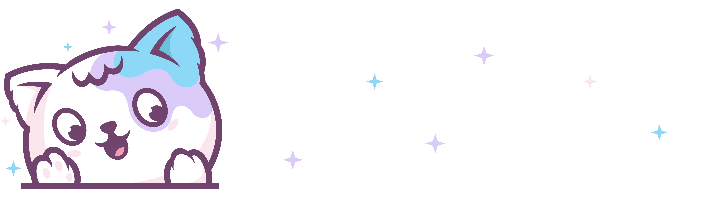

<a id="readme-top"></a>

<p align="center">

</p>

[![Contributors][contributors-shield]][contributors-url]
[![Forks][forks-shield]][forks-url]
[![Stargazers][stars-shield]][stars-url]
[![Issues][issues-shield]][issues-url]
[![Unlicense License][license-shield]][license-url]

<!-- PROJECT LOGO -->
<br />
<div align="center">
  <a href="https://github.com/your-username/katling">
    
  </a>

  <p align="center">
    <strong>An AI-powered English learning platform that makes language learning fun and effective!</strong>
    <br />
    <br />
    <a href="#-features">Features</a>
    ·
    <a href="#-getting-started">Getting Started</a>
    ·
    <a href="#-tech-stack">Tech Stack</a>
    ·
    <a href="#-contributing">Contributing</a>
  </p>

</div>

<!-- TABLE OF CONTENTS -->
<details>
  <summary>Table of Contents</summary>
  <ol>
    <li>
      <a href="#about-the-project">About The Project</a>
      <ul>
        <li><a href="#built-with">Built With</a></li>
      </ul>
    </li>
    <li>
      <a href="#getting-started">Getting Started</a>
      <ul>
        <li><a href="#prerequisites">Prerequisites</a></li>
        <li><a href="#installation">Installation</a></li>
      </ul>
    </li>
    <li><a href="#usage">Usage</a></li>
    <li><a href="#roadmap">Roadmap</a></li>
    <li><a href="#contributing">Contributing</a></li>
    <li><a href="#license">License</a></li>
    <li><a href="#contact">Contact</a></li>
    <li><a href="#acknowledgments">Acknowledgments</a></li>
  </ol>
</details>

---

## 📖 About The Project

This repository contains the code and documentation for the Final Project of  Introduction to Software Engineering Course (CSC13002). The project focuses on developing Katling - a English learning system.

**Katling** is a comprehensive English learning platform designed to help learners improve their language skills through interactive lessons, AI-powered conversations, pronunciation practice, and gamification elements. Whether you're a beginner or looking to polish your English skills, Katling provides a personalized and engaging learning experience.

### 🎯 Why Katling?

- **Interactive Learning**: Structured lessons with topics, sections, and various question types
- **AI Conversation Partner**: Practice real conversations with our AI-powered chat system
- **Pronunciation Feedback**: Get instant feedback on your pronunciation using ML models
- **Gamification**: Daily missions, XP rewards, streaks, and leaderboards to keep you motivated
- **Vocabulary Building**: Flashcards with spaced repetition for effective memorization
- **Community Features**: Connect with friends, share posts, and learn together

---

## 🛠️ Tech Stack

### Frontend

<p align="center">
  <a href="https://react.dev/" target="_blank" rel="noreferrer"></a>
  <a href="https://react.dev/" target="_blank" rel="noreferrer"></a>
  <a href="https://react.dev/" target="_blank" rel="noreferrer"></a>
  <a href="https://react.dev/" target="_blank" rel="noreferrer"></a>
  <a href="https://www.typescriptlang.org/" target="_blank" rel="noreferrer"></a>
  <a href="https://vite.dev/" target="_blank" rel="noreferrer"></a>
  <a href="https://tailwindcss.com/" target="_blank" rel="noreferrer"></a>
  <a href="https://firebase.google.com/" target="_blank" rel="noreferrer"></a>
</p>

### Backend

<p align="center">
  <a href="https://fastapi.tiangolo.com/" target="_blank" rel="noreferrer"></a>
  <a href="https://www.postgresql.org/docs/" target="_blank" rel="noreferrer"></a>
  <a href="https://dev.mysql.com/doc/" target="_blank" rel="noreferrer"></a>
  <a href="https://dev.mysql.com/doc/" target="_blank" rel="noreferrer"></a>
</p>

### AI / ML

<p align="center">
  <a href="https://fastapi.tiangolo.com/" target="_blank" rel="noreferrer"></a>
</p>

---

## 🚀 Getting Started

> 📖 **For detailed setup instructions, see [SETUP.md](docs/SETUP.md)**

### Quick Start with Docker

1. Clone the repository:
   ```bash
   git clone https://github.com/VincentBoy0/Katling.git
   cd katling
   ```

2. Set up environment variables (copy from `.env.example` files)

3. Start the application:
   ```bash
   docker-compose up --build
   ```

4. Access the application:
   - **Frontend**: http://localhost:5173
   - **Backend API**: http://localhost:8000
   - **API Docs**: http://localhost:8000/docs

---

## 📁 Project Structure

```
katling/
├── 🐳 docker-compose.yml      # Docker orchestration
├── 📖 README.md
├── 📚 docs/                   # Documentation
│
├── 🔧 backend/
│   ├── app/
│   │   ├── api/               # API route handlers
│   │   │   ├── community/     # Friends, posts endpoints
│   │   │   ├── general/       # Auth, user, reports
│   │   │   ├── learning/      # Lessons, vocab, flashcards, pronunciation
│   │   │   └── management/    # Admin, moderator endpoints
│   │   ├── core/              # Config, security, Firebase setup
│   │   ├── database/          # Database session management
│   │   ├── ml_models/         # Machine learning models
│   │   ├── models/            # SQLModel database models
│   │   ├── repositories/      # Data access layer
│   │   ├── schemas/           # Pydantic request/response schemas
│   │   └── services/          # Business logic services
│   ├── alembic/               # Database migrations
│   ├── scripts/               # Utility scripts (seed, reset)
│   ├── requirements.txt
│   └── Dockerfile
│
└── 🎨 frontend/
    ├── src/
    │   ├── app/               # App configuration
    │   ├── components/        # Reusable UI components
    │   ├── context/           # React context providers
    │   ├── hooks/             # Custom React hooks
    │   ├── layouts/           # Page layouts
    │   ├── pages/             # Page components
    │   │   ├── admin/         # Admin dashboard pages
    │   │   ├── learner/       # Learner pages (dashboard, lessons, etc.)
    │   │   └── moderator/     # Moderator pages
    │   ├── services/          # API service functions
    │   └── types/             # TypeScript type definitions
    ├── public/                # Static assets
    ├── package.json
    └── Dockerfile
```

---

## 📚 Documentation

- [Setup Guide](/docs/SETUP.md)
- [API Documentation](/docs/API.md)

---

## 🤝 Contributing

Contributions are what make the open source community such an amazing place to learn, inspire, and create. Any contributions you make are **greatly appreciated**.

If you have a suggestion that would make this better, please fork the repo and create a pull request. You can also simply open an issue with the tag "enhancement". Don't forget to give the project a star! Thanks again!

1. Fork the Project
2. Create your Feature Branch (`git checkout -b feature/AmazingFeature`)
3. Commit your Changes (`git commit -m 'Add some AmazingFeature'`)
4. Push to the Branch (`git push origin feature/AmazingFeature`)
5. Open a Pull Request

### Development Guidelines

- Follow existing code style and conventions
- Write meaningful commit messages
- Add tests for new features
- Update documentation as needed

---

## 📄 License

Distributed under the MIT License. See `LICENSE` for more information.

---

## 👨‍💻 Authors

Made with ❤️ by the Group 3:

<a href="https://github.com/VincentBoy0/Katling/graphs/contributors">
  
</a>


---

## 🙏 Acknowledgments

- [FastAPI](https://fastapi.tiangolo.com/) - Modern Python web framework
- [React](https://react.dev/) - JavaScript library for building user interfaces
- [Radix UI](https://www.radix-ui.com/) - Accessible component primitives
- [Tailwind CSS](https://tailwindcss.com/) - Utility-first CSS framework
- [Google Gemini](https://ai.google.dev/) - Generative AI capabilities
- [Hugging Face](https://huggingface.co/) - ML models for pronunciation

---

<div align="center">
  <p>⭐ Star this repo if you find it helpful! ⭐</p>
  <a href="#readme-top">Back to Top ↑</a>
</div>


[contributors-shield]: https://img.shields.io/github/contributors/VincentBoy0/Katling.svg?style=for-the-badge
[contributors-url]: https://github.com/VincentBoy0/Katling/graphs/contributors
[forks-shield]: https://img.shields.io/github/forks/VincentBoy0/Katling.svg?style=for-the-badge
[forks-url]: https://github.com/VincentBoy0/Katling/network/members
[stars-shield]: https://img.shields.io/github/stars/VincentBoy0/Katling.svg?style=for-the-badge
[stars-url]: https://github.com/VincentBoy0/Katling/stargazers
[issues-shield]: https://img.shields.io/github/issues/VincentBoy0/Katling.svg?style=for-the-badge
[issues-url]: https://github.com/VincentBoy0/Katling/issues
[license-shield]: https://img.shields.io/github/license/VincentBoy0/Katling.svg?style=for-the-badge
[license-url]: https://github.com/VincentBoy0/Katling/blob/master/LICENSE.txt
